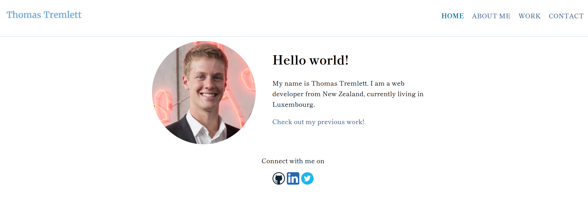

# Portfolio Website - A site designed to show off my programming projects.

## Purpose
The purpose of this website is to:
* Create a platform where I can show off what I've been working on, both to potential employers and the wider tech community.
* To get an initial introduction to/practice with basic HTML, CSS and JavaScript.

## Technologies Used
* HTML
* CSS
* JavaScript
* Tota11y - an accessibility developer tool

## Link to live site
* Hosted through Github Pages - https://t-dogg-po.github.io/portfolio-site/
